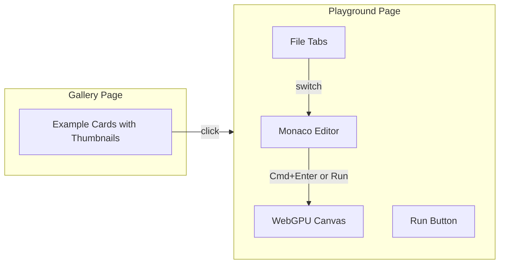

# Interactive Examples Gallery

## Design Decisions

| Question         | Decision                                                                 |
| ---------------- | ------------------------------------------------------------------------ |
| Code editor      | **Monaco Editor** - Full VS Code experience with TypeScript IntelliSense |
| Preview behavior | **Manual run** - User clicks "Run" button or presses Cmd/Ctrl+Enter      |

## Architecture Overview



## Key Components

### 1. Gallery Page (`/app/page.tsx`)

- Grid of example cards with pre-rendered thumbnail images
- Each card shows: thumbnail, title, short description
- Thumbnails stored in `/public/thumbnails/[example-name].png`
- Generate thumbnails via a script that renders each example and captures a frame

### 2. Playground Page (`/app/playground/[slug]/page.tsx`)

- Split layout: Monaco editor (left) + WebGPU preview (right)
- File tabs for switching between `index.ts` and `index.html`
- Run button + Cmd/Ctrl+Enter keyboard shortcut
- Error display panel for shader compilation errors

### 3. Example Data Structure

Each example will have its source files in a new structure:

```
/examples/
  basic/
    index.ts      # Main shader code
    index.html    # HTML template (optional, use default)
    meta.json     # { title, description, thumbnail }
```

## Implementation Details

### Monaco Editor Setup

Use `@monaco-editor/react` package which handles Monaco loading. Configure:

- TypeScript language for `.ts` files
- HTML language for `.html` files
- Dark theme matching the app
- Keyboard binding for Cmd/Ctrl+Enter to run

```tsx
// Key configuration
<Editor
  language={activeFile.endsWith(".ts") ? "typescript" : "html"}
  theme="vs-dark"
  onMount={(editor, monaco) => {
    editor.addCommand(monaco.KeyMod.CtrlCmd | monaco.KeyCode.Enter, runCode);
  }}
/>
```

### Preview Component

- Renders WebGPU canvas
- Receives code from editor state
- On "Run": disposes old context, re-initializes with new code
- Shows compilation errors in an overlay/panel

### Code Execution Strategy

Since we can't use `eval()` safely with imports, we'll:

1. Store example code as static files
2. On edit, create a blob URL with modified code
3. Use dynamic import or iframe sandboxing

Alternative approach (simpler): The examples already work - we just need to let users edit the WGSL shader code portion, not the full TypeScript. This is similar to Shadertoy.

**Recommended**: Focus on shader code editing only (the WGSL string), not full TypeScript execution. This is:

- Safer (no arbitrary code execution)
- Simpler to implement
- What users actually want to tweak

## File Changes

### New Dependencies

Add to `apps/examples/package.json`:

```json
"@monaco-editor/react": "^4.6.0"
```

### New/Modified Files

- `apps/examples/app/page.tsx` - Gallery grid with thumbnails
- `apps/examples/app/playground/[slug]/page.tsx` - Main playground page
- `apps/examples/components/MonacoEditor.tsx` - Monaco wrapper
- `apps/examples/components/Preview.tsx` - WebGPU preview component
- `apps/examples/components/FileTabs.tsx` - File tab switcher
- `apps/examples/lib/examples.ts` - Example metadata and code loader
- `apps/examples/public/thumbnails/` - Pre-rendered example images
- `scripts/generate-thumbnails.ts` - Script to capture example thumbnails

### Example Data Files

Move shader code to extractable format in each example folder or create a centralized examples registry.

## Thumbnail Generation

Create a Playwright script that:

1. Navigates to each example
2. Waits for WebGPU to render
3. Takes a screenshot
4. Saves to `/public/thumbnails/[name].png`

## UI Layout

```
+------------------+------------------------+
|  [File Tabs]     |                        |
|  index.ts        |                        |
|  index.html      |      WebGPU Canvas     |
+------------------+      (Preview)         |
|                  |                        |
|  Monaco Editor   |    [Run] button        |
|                  |                        |
+------------------+------------------------+
```
