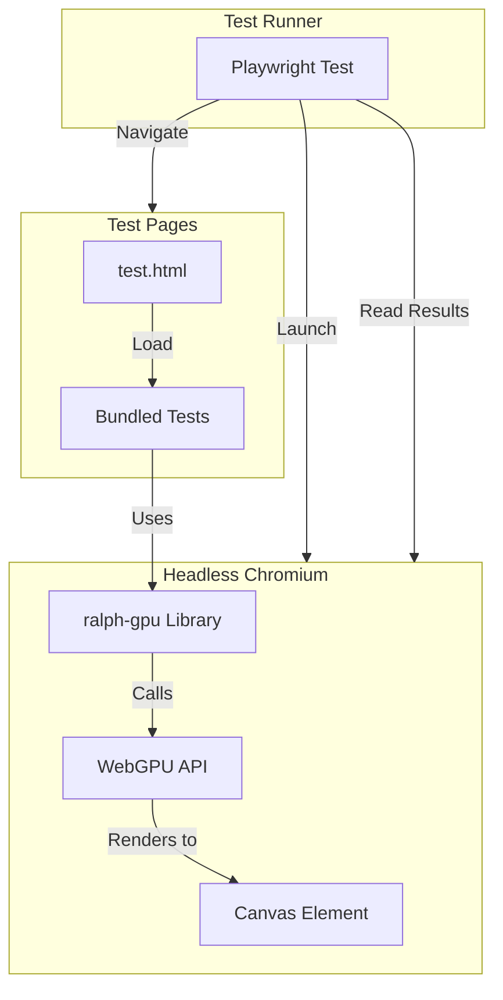

# Migrate Tests to Playwright with Real WebGPU

## Agent Instructions

This document is designed to be used by a long-running LLM agent to track progress on migrating the ralph-gpu test suite to Playwright with real WebGPU.

**How to use this document:**

1. **Read this file at the start of each session** to understand the current state and what needs to be done next.
2. **Update the Task Checklist** as you complete tasks (change `- [ ]` to `- [x]`).
3. **Modify the todos freely** - Add new tasks as you discover them, split tasks if they're too large, remove tasks that become unnecessary, or reorder based on dependencies.
4. **Document findings in the Learnings & Notes section** - Record any important discoveries, gotchas, configuration details, or decisions made during implementation.
5. **Update the Implementation Strategy** if the approach needs to change based on what you learn.

The goal is to keep this document as the single source of truth for this task's progress and knowledge.

### Code Implementation via Ralphs

**Do NOT implement code changes directly.** Instead, use the ralph-loop system to ship code autonomously.

For each task in the checklist:

1. Create a new ralph script in `ralphs/` following the template in [`ralphs/ralph-loop-prompt.md`](../ralphs/ralph-loop-prompt.md)
2. Define clear acceptance criteria and verification functions
3. Run the ralph and monitor progress
4. Commit successful changes before moving to the next task
5. Update this plan file with learnings and progress

**Ralph Loop Summary:** Ralph Loop is an autonomous AI agent library (`@ralph/agent-loop`) that runs an AI model in a loop with tools (bash, file operations, browser automation) until a task is completed. It includes progress tracking, stuck detection, and trace mode for debugging. Each ralph script lives in its own numbered folder under `ralphs/` with a focused task definition.

---

## Task Checklist

- [x] **Setup Playwright** - Install Playwright and create playwright.config.ts with WebGPU-enabled Chrome settings
- [x] **Test Harness** - Create HTML test page and bundle configuration for browser tests
- [x] **Test Utils** - Create browser test utilities (setupTest, readPixels, teardown, pixel comparison helpers)
- [x] **Context Tests** - Write browser tests for GPU context initialization and basic rendering
- [x] **Pass Tests** - Write browser tests for Pass (fragment shaders, uniforms, blending)
- [x] **Compute Tests** - Write browser tests for ComputeShader execution and output verification
- [x] **Storage Tests** - Write browser tests for StorageBuffer read/write operations
- [x] **Target Tests** - Write browser tests for RenderTarget creation, rendering, and readPixels
- [ ] **Advanced Tests** - Write browser tests for PingPong, Sampler, Particles, and MRT features
- [ ] **Update Scripts** - Update package.json with new test scripts and Vitest config to exclude browser tests

## Current State

The tests in [`packages/core/tests/`](packages/core/tests/) currently:

- Run in Node.js with Vitest + jsdom
- Mock all WebGPU APIs (`GPUDevice`, `GPUBuffer`, `GPUTexture`, etc.)
- Test type checking, WGSL parsing, and validation logic
- Cannot test actual GPU execution (shader compilation, render passes, texture sampling)

## Goal

Run tests in a headless Chromium browser with real WebGPU support to test:

- Actual GPU device creation and initialization
- Shader compilation and error handling
- Render pass execution and output verification
- Texture creation, sampling, and storage operations
- Storage buffer read/write operations
- Compute shader execution

## Architecture



## Implementation Strategy

### 1. Test Infrastructure Setup

Add Playwright and configure it for WebGPU testing:

- Add `@playwright/test` as a dev dependency
- Create [`packages/core/playwright.config.ts`](packages/core/playwright.config.ts) with:
  - Chrome/Chromium with `--enable-unsafe-webgpu` and `--enable-features=Vulkan` flags
  - Headless mode for CI, headed option for debugging
  - Test timeout configuration for GPU operations

### 2. Test Page Setup

Create a minimal HTML test harness:

- [`packages/core/tests/browser/index.html`](packages/core/tests/browser/index.html) - Test page with canvas
- Bundle ralph-gpu for browser execution (can reuse existing webpack config)
- Expose test utilities on `window` for Playwright to call

### 3. Test Helper Utilities

Create [`packages/core/tests/browser/test-utils.ts`](packages/core/tests/browser/test-utils.ts):

```typescript
// Initialize GPU context for tests
export async function setupTest(): Promise<{
  ctx: GPUContext;
  canvas: HTMLCanvasElement;
}> {
  const canvas = document.createElement("canvas");
  canvas.width = 256;
  canvas.height = 256;
  document.body.appendChild(canvas);
  const ctx = await gpu.init(canvas);
  return { ctx, canvas };
}

// Read pixels and compare
export function readPixels(ctx: GPUContext): Promise<Uint8Array>;

// Cleanup
export function teardown(ctx: GPUContext, canvas: HTMLCanvasElement): void;
```

### 4. Test Categories

Split tests into two categories:

**Unit Tests (keep as Vitest with mocks):**

- [`api-exports.test.ts`](packages/core/tests/api-exports.test.ts) - API surface validation
- [`types.test.ts`](packages/core/tests/types.test.ts) - TypeScript type checks
- [`texture-bindings.test.ts`](packages/core/tests/texture-bindings.test.ts) - WGSL parsing (pure logic)
- [`errors.test.ts`](packages/core/tests/errors.test.ts) - Error class definitions

**Browser Tests (new Playwright tests):**

- `context.browser.test.ts` - Real GPU initialization
- `pass.browser.test.ts` - Fragment shader rendering
- `compute.browser.test.ts` - Compute shader execution
- `storage.browser.test.ts` - Storage buffer operations
- `target.browser.test.ts` - Render target creation/rendering
- `ping-pong.browser.test.ts` - Ping-pong buffer swapping
- `sampler.browser.test.ts` - Texture sampling with real samplers
- `particles.browser.test.ts` - Particle system rendering

### 5. Example Browser Test Structure

```typescript
// packages/core/tests/browser/context.browser.test.ts
import { test, expect } from "@playwright/test";

test.describe("GPU Context", () => {
  test("should initialize WebGPU context", async ({ page }) => {
    await page.goto("/test.html");

    const result = await page.evaluate(async () => {
      const canvas = document.createElement("canvas");
      canvas.width = 256;
      canvas.height = 256;
      document.body.appendChild(canvas);

      const { gpu } = window.RalphGPU;
      const ctx = await gpu.init(canvas);

      return {
        width: ctx.width,
        height: ctx.height,
        supported: gpu.isSupported(),
      };
    });

    expect(result.supported).toBe(true);
    expect(result.width).toBe(256);
    expect(result.height).toBe(256);
  });

  test("should render a simple shader", async ({ page }) => {
    await page.goto("/test.html");

    const pixels = await page.evaluate(async () => {
      const { gpu } = window.RalphGPU;
      const canvas = document.querySelector("canvas");
      const ctx = await gpu.init(canvas);

      const pass = ctx.pass(`
        @fragment
        fn main() -> @location(0) vec4f {
          return vec4f(1.0, 0.0, 0.0, 1.0); // Red
        }
      `);

      ctx.drawPass(pass);
      const data = await ctx.readPixels(0, 0, 1, 1);
      return Array.from(data.slice(0, 4));
    });

    // Check red pixel (RGBA)
    expect(pixels[0]).toBeGreaterThan(200); // R
    expect(pixels[1]).toBeLessThan(50); // G
    expect(pixels[2]).toBeLessThan(50); // B
  });
});
```

### 6. Package.json Scripts

Add new scripts to [`packages/core/package.json`](packages/core/package.json):

```json
{
  "scripts": {
    "test": "vitest run",
    "test:browser": "playwright test",
    "test:all": "vitest run && playwright test",
    "test:browser:headed": "playwright test --headed"
  }
}
```

### 7. CI Configuration

Update CI to run browser tests:

- Install Playwright browsers in CI
- Use `xvfb-run` or similar for headless GPU on Linux
- Consider software rendering fallback with SwiftShader for environments without GPU

## Key Files to Create

- `packages/core/playwright.config.ts`
- `packages/core/tests/browser/index.html`
- `packages/core/tests/browser/test-utils.ts`
- `packages/core/tests/browser/*.browser.test.ts` (one per feature)

## Key Files to Modify

- `packages/core/package.json` - Add playwright dependency and scripts
- `packages/core/vitest.config.ts` - Exclude browser tests from Vitest runs

---

## Learnings & Notes

> Document important findings, gotchas, configuration details, and decisions here as you work through the implementation.

### Configuration & Setup

- Playwright config lives at `packages/core/playwright.config.ts` with Chromium args `--enable-unsafe-webgpu` and `--enable-features=Vulkan`.
- Browser harness is served via `packages/core/tests/browser/index.html` and a webpack bundle from `tests/browser/webpack.config.js`.

### WebGPU-Specific Findings

_(Add notes about WebGPU behavior in headless mode, timing issues, etc.)_

### Test Patterns

- `tests/browser/test-utils.ts` provides `setupTest`, `readPixels`, `teardown`, and pixel comparison helpers for consistent readback.
- `tests/browser/index.ts` exposes `window.RalphGPU` and `window.RalphTestUtils` for Playwright `page.evaluate`.

### Issues & Solutions

_(Document any problems encountered and how they were solved)_

### Decisions Made

- Ralph `.progress.md` files are updated only by ralphs; human progress tracking happens in this plan file.
